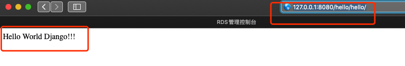
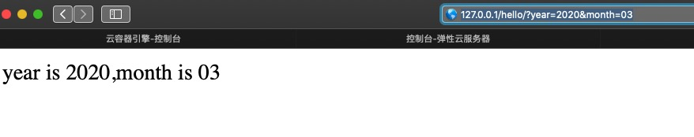
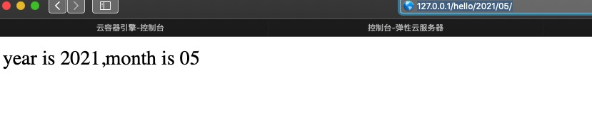
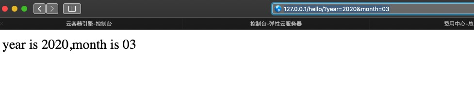

# Django 学习之路

## 第一章 环境准备

### Python虚拟环境安装

1. #### 安装pyenv并创建虚拟环境

   ``````shell
   # 安装pyenv python环境
   brew update
   brew install pyenv
   #安装python环境，根据自己需要安装对应版本
   pyenv install 3.6.10
   #安装 virtualenv 虚拟环境
   brew install pyenv-virtualenv
   #利用pyenv的虚拟环境，创建python虚拟环境
   pyenv virtualenv 3.6.10 devops-3610
   #进入项目目录后可指定项目使用的虚拟环境
   cd $projet && pyenv local devops-3610
   ``````

2. #### Django初识

   ```shell
   #创建Django项目 版本2.2
   cd $projet && pip install Django==2.2.0
   django-admin startproject devops
   #查看目录层级
   tree ./devops
   ./
   ├── devops
   │   ├── __init__.py
   │   ├── settings.py
   │   ├── urls.py
   │   └── wsgi.py
   └── manage.py
   ```
   
   

## 第二章 第一个Hello World Django

###  Django初探

1. #### 数据库配置修改

   ```shell
   #修改访问权限，全部地址可以访问
   ALLOWED_HOSTS = ["*"] 
   #编辑settings.py 修改数据库信息
   DATABASES = {
       'default': {
           'ENGINE': 'django.db.backends.mysql',#使用的数据库
           'NAME': 'devops',#数据库名
           'HOST': '39.106.16.255',#数据库地址
           'POST': '3306',#数据库端口
           'USER': 'fanxuefei',#数据库用户名
           'PASSWORD': '123456',#数据库密码
   
       }
   }
   #修改Django项目语言
   LANGUAGE_CODE = 'zh-hans'
   #修改Django项目时区
   TIME_ZONE = 'Asia/Shanghai'
   ```

2. #### 第一个helloword

   - 创建hello App

     ```shell
     #创建hello APP
     cd $projet && python manage,py startapp hello
     tree ./hello
     ├── hello
     │   ├── __init__.py
     │   ├── admin.py
     │   ├── apps.py
     │   ├── migrations
     │   │   ├── __init__.py
     │   │   └── __pycache__
     │   │       └── __init__.cpython-36.pyc
     │   ├── models.py
     │   ├── tests.py
     │   ├── urls.py
     │   └── views.py
     ```

   - 注册hello App

     ```shell
     #注册app
     vim $projet/devops/settings.py
     
     INSTALLED_APPS = [
         'django.contrib.admin',
         'django.contrib.auth',
         'django.contrib.contenttypes',
         'django.contrib.sessions',
         'django.contrib.messages',
         'django.contrib.staticfiles',
         'hello.apps.HelloConfig', #注册 hello APP
     ]
     ```

   

   - 创建主路由并路由到app路由

     ```python
     vim $projet/devops/urls.py
     
     from django.contrib import admin
     from django.urls import path, include
     
     
     urlpatterns = [
         path('admin/', admin.site.urls),
         path('hello/', include('hello.urls')),#添加hello，并路由到helloApp下的urls
     ]
     ```

   - 创建hello App路由规则

     ```python
     vim $projet/devops/hello/urls.py
     
     from django.urls import path
     
     from . import views
     
     urlpatterns = {
        # path('hello/', views.index, name='index'),#访问模式ip/hello/hello多子路由
       	path('', views.index, name='index') #访问模式ip/hello 子路由直接访问
     }
     
     ```
  ```
   
- 创建视图views 方法
   
     ```python
     vim $projet/devops/hello/views.py
     
     from django.shortcuts import render
     from django.http import HttpResponse
     
     def index(request):
         return HttpResponse("<p>Hello World Django!!!</p>")#访问hello接口返回字符串
  ```

- 启动项目并测试访问结果
  
     ```shell
     cd $projet/ && python manage.py runserver 0.0.0.0:8080
     #启动项目后浏览器访问本地ip接口
  ```
  
  
  
     

## 第三章 视图初识

### request

- 2大类5小类

  - 两大类

    ```bash
    GET #直接请求，
    	- 不不带参数
    	- 带参数
    		- ?参数—— url
    		- 位置参数——url设计
    		- 关键字参数——url设计
    POST #常用于表单请求，正常情况下都带参数 
    ```

  - 五小类

    ```bash
    # get不不带参数 get通过?加参数 post请求的url格式如下 
    path('hello/', views.index, name='index'),
    # 关键字传参数 (?<参数名>参数类型)——视图中直接通过参数名获取值(最常⽤用)
    re_path('hello/(?P<year>[0-9]{4})/(?P<month>[0-9]{2})/',views.index,name='index')
     
    ```

### response

- 2大类3小类

  - 2大类 GET、POST， 3小类 方法

    ```bash
    - request.method #判断请求的方式
    - request.body #第一种获取数据的方式
    - print(type(request.body)) # byte
    - print(QueryDict(request.body)) # QueryDict
    - print(QueryDict(request.body).dict) # dict
     - request.GET # 第⼆种⽅方式获取GET QueryDict 
     	- request.GET.get('name','devops')
    - request.POST # 第⼆种获取post数据⽅方式 <QueryDict: {'year': ['2019']
    	- request.POST.getlist('id')
    - kwargs.get('year', 2018) # 第三种获取GET 只适⽤用关键字请求的数据 
    ```

### 不带参数的读

- 用户请求不带参数的url

  ```python
  # http://127.0.0.1/hello/
  #url.py
  path('', views.index, name='index')
  #views.py
  def index(request):
      return HttpResponse("<p>Hello World,Hello, Django</p>")
  ```

- 用户请求带参数的url

  - 普通传参”?“

  ```python
  # http://127.0.0.1/hello/?year=2020&month=03
  #url.py 普通传参和无参数一样
  path('', views.index1, name = 'index1'),
  #views.py
  def index1(request):
      # 设置默认值的方式获取数据更优雅
      year = request.GET.get("year","2019")
      # 直接获取数据，没有传会报错，不建议
      month = request.GET["month"]
      return HttpResponse("year is %s,month is %s" % (year,month))
  ```

  

  - 位置传参

  ```python
  # http://127.0.0.1/hello/2020/03
  #url.py
  re_path('(?P<year>[0-9]{4})/(?P<month>[0-9]{2})/', views.index2, name= 'index2'),
  #views.py  位置参数的接收方法——函数中的参数和URL中的位置⼀一对应(严重依赖参数顺序 且代码可读性不好，不推荐)
  def index2(request,year,month):
  	return HttpResponse("year is %s,month is %s" % (year,month))
  ```

  

  - 关键字传参

  ```python
  #关键字传参数(?<参数名>参数类型)——视图中直接通过参数名获取值(最常⽤用)
  #url.py  等同位置传参 路由配置方式
  #views.py 
  def index2(request, **kwargs):
      year = kwargs.get('year', 2020)
      month = kwargs.get('month', 3)
      return HttpResponse("year is %s,month is %s" % (year,month))
   # 另⼀一种写法——函数参数位置⽆无关，以关键字为准
  def index2(request, year=2020, month = 3):
      return HttpResponse("year is %s,month is %s" % (year,month))
  ```

  

### 带参数的写

- 视图通过request.POST⽅方法获取数据

  ```python
  #url.py 
  path('', views.index1, name='index1'),
  #views.py
  def index3(request):
      print(request.scheme) #获取访问协议
      print(request.method) #获取访问方式 GET or POST
      print(request.path) #获取访问路径url
      data = request.GET
      year = data.get('year',"2019")
      month = data.get('month', "03")
      if request.method == "POST":
          year = data.get('year', "2020")
          month = data.get("month", "03")
      return HttpResponse("year is %s,month is %s" % (year,month))
  #get 方法
  curl 127.0.0.1/hello/
  year is 2019,month is 03%
  #post 方法
  curl -X POST http://127.0.0.1/hello/ -d 'year=2019&month=06'
  year is 2020,month is %03%
  ```

  

##  第四章 ORM建模初识

### 创建第一个表单User表

- 利用django ORM框架创建表单

  ```python
  from django.db import models
  
  class User(models.Model):
      SEX = (
          ('0', '男'),
          ('1', '女')
      )
      name = models.CharField(max_length=20, help_text="用户名")
      password = models.CharField(max_length= 32, help_text="密码")
      sex = models.IntegerField(choices= SEX, null=True, blank=True)
  
      def __str__(self):
          return (self.name, self.password, self.sex)
  ```

- 数据库生成数据表

  ```bash
  # 生成迁移脚本
  python manage.py makemigrations hello
  #展示迁移语句，格式 app_label=hello  migration_name=0001 创建的脚本名称
  python manage.py sqlmigrate hello 0001
  #执行数据库命令
  python manage.py migrate hello
  #到这里就可以查看数据库内生成的空表
  ```

- Django 关于数据库的常用命令

  ```SHELL
   python manage.py makemigrations appname  	# ⽣生成迁移脚本
   python manage.py sqlmigrate appname 0001 	# 展示迁移的sql语句句
   python manage.py migrate										# 执⾏行行数据库命令
   python manage.py showmigrations						# 所有的app及对应的已经⽣生效的migration
  # 将某个app的migration重置，出现冲突时这么⼲干
  python manage.py migrate --fake appname hello
  # 强制执⾏行行某个版本的迁移脚本
  python manage.py migrate --fake hello
  python manage.py migrate --fake hello 0003
  ```

### ORM简单介绍功能

- 增删改查

  - 增

  ```python
  #基于模块的调用方式
  from hello.models import User
  result = User.objects.all() ## 通过models.实例化对象，查询数据
  #增、创建
  User.objects.create(name='kk'，password="123456") #指定字段插入
  ## 不定长插入
  data = {'name':'kk','password':'123456'}
  User.objects.create(**data)
  ## objects.get_or_create方式
  User.objects.get_or_create(name="WZT",) #防止重复，速度相对较慢
  ```

  

  - 删

  ```python
  #删除一条，指定删除
  u = User.objects.get(name='kk') 
  u.delete()
  #过滤掉件，全部删除
  data={"name":"kk"}
  User.objects.filter(**data).delete()
  #删除所有
  User.objects.all().delete()
  ```

  

  - 改

  ```python
  #指定列更新
  User.objects.filter(id = 5).update(name="cjk",password='123') #成功返回被影响的语句 1，不成功显示0
  #不定长更新
  data = {'name':'cjk','password':'123456'}
  User.objects.filter(id = 5 ).update(**data)
  ```

  

  - 查

  ```python
  #查询全部
  In [5]: User.objects.all()                                                                                                                                 
  Out[5]: <QuerySet [<User: kk>, <User: cjk>, <User: kk1>, <User: kk2>, <User: kk3>]>
  #指定字段查询单条记录，多条重复记录，会报错，只返回一条记录，一般多为主键查询
  IIn [10]: User.objects.get(id=5)                                                                                                                            
  Out[10]: <User: cjk>
  #返回指定字段的值
  In [18]: User.objects.all().values("name","password")                                                                                                      
  Out[18]: <QuerySet [{'name': 'kk', 'password': '123456'}, {'name': 'cjk', 'password': '123456'}, {'name': 'kk1', 'password': '123456'}, {'name': 'kk2', 'password': '123456'}, {'name': 'kk3', 'password': '123456'}]>
  In [19]: User.objects.all().values_list("name","password")                                                                                                 
  Out[19]: <QuerySet [('kk', '123456'), ('cjk', '123456'), ('kk1', '123456'), ('kk2', '123456'), ('kk3', '123456')]>
  #过滤查询  filter 相当于 sql语句的  where
  In [20]: User.objects.filter(name='kk3')     #查询name为kk3的记录，返回QuerySet对象
  Out[20]: <QuerySet [<User: kk3>]>
  In [21]: User.objects.filter(name='kk3').get() #根据条件返回一个字典                                                                                                         
  Out[21]: <User: kk3>
  In [22]: User.objects.filter(name='kk3').get().password #根据属性获取values                                                                                  
  Out[22]: '123456'
  ## 不区分大小写过滤
  In [23]: User.objects.filter(name__iexact = "kk")                                                                                                          
  Out[23]: <QuerySet [<User: kk>]>
  ## 包含过滤  类似于 like 语法
  In [30]: User.objects.filter(name__icontains='kk')                                                                                                         
  Out[30]: <QuerySet [<User: kk>, <User: kk1>, <User: kk2>, <User: kk3>]>
  ## 只要有k 就算
  In [31]: User.objects.filter(name__icontains='k')                                                                                                          
  Out[31]: <QuerySet [<User: kk>, <User: cjk>, <User: kk1>, <User: kk2>, <User: kk3>]>
  #values——返回所有列列的k/v值或者指定的列列
  In [2]: User.objects.filter(id=1)                                                                                                                          
Out[2]: <QuerySet [<User: kk>]>
  #查出全部结果，以列表嵌套字典的形式展现
In [3]: User.objects.filter(id=1).values()                                                                                                                 
  Out[3]: <QuerySet [{'id': 1, 'name': 'kk', 'password': '123456', 'sex': None}]>
#查出指定列的内容
  In [4]: User.objects.filter(id = 1).values('id','name')                                                                                                                  
Out[4]: <QuerySet [{'id': 1, 'name': 'kk'}]>
  #排序查找，根据表字段排序
  In [5]: User.objects.all().order_by('id')                                                                                                                                
  Out[5]: <QuerySet [<User: kk>, <User: cjk>, <User: kk1>, <User: kk2>, <User: kk3>]>
  
  In [6]: User.objects.all().order_by('name')                                                                                                                              
  Out[6]: <QuerySet [<User: cjk>, <User: kk>, <User: kk1>, <User: kk2>, <User: kk3>]>
  
  #raw执行原生sql语句
  In [11]: from hello.models import User                                                                                                                                   
  In [12]: res = User.objects.raw('select * from hello_user')                                                                                                              
  In [13]: for i in res: 
      ...:     print(i.name) 
      ...:                      
  ```
  
  

## 第五章 模板初识

### 模板一体化

- 常用写法

  ```html
  <!DOCTYPE html>
  <html lang="zh">
  <head>
      <meta charset="UTF-8">
      <title>自动化运维平台</title>
  </head>
  <body>
      <p style="background-color: yellowgreen;">用户列表</p>
      <table border="1">
          <thead>
              <tr>
                  <th>ID</th>
                  <th>姓名</th>
                  <th>密码</th>
              </tr>
          </thead>
          <tbody>
              
              <tr>
                  <td>{{ user.id }}</td>
                  <td>{{ user.name }}</td>
                  <td>{{ user.password }}</td>
              </tr>
              
          </tbody>
  
      </table>
  <p style="background-color:red;">版权所有:测试版权</p>
  </body>
  </html>
  ```

- 模板继承及渲染

  - 定义母版

  ```html
  <!--定义母版-->
  <!DOCTYPE html>
  <html lang="en">
  <head>
      <meta charset="UTF-8">
      <title>自动化运维平台</title>
  </head>
  
  <body>
  <!-- 每个⻚页⾯面都有个标题且样式基本不不会变，可以抽象出来。变的标题内容做成变量量 -->
  <p style="background-color:yellow;"
     >  用户列表  </p>
  <!-- ⻚页⾯面都内容往往是变化的这⼀一块，做成变量量即可 -->
  
  
  <!-- 每个⻚页⾯面都有个底部且样式基本不不会变，可以抽象出来 -->
  <p style="background-color:red;">版权所有:⻢马哥教育</p>
  </body>
  </html>
  ```

  - 定义子版

  ```html
  <!-- 定义子版 -->
  <!-- 继承⺟母版不不变的部分 -->
  
  
  <!-- 重写⺟母版变的部分-->
   ⽤户的列表 
  
  <!-- 重写⺟母版变的部分-->
  
  <table border="1">
      <thead>
          <tr>
              <th>ID</th>
              <th>姓名</th>
              <th>密码</th>
          </tr>
      </thead>
      <tbody>
      
          <tr>
              <td>{{ user.id }}</td>
              <td>{{ user.name }}</td>
              <td>{{ user.password }}</td>
          </tr>
      
  </tbody>
  </table>
  
  ```

### 自定义模板标签和过滤器

- 自定义标签和过滤器的代码布局

  ```shell
  hello/
  ├── __init__.py
  ├── admin.py
  ├── apps.py
  ├── migrations
  │   └── __init__.py
  ├── models.py
  ├── templatetags#自定义标签目录
  │   ├── __init__.py
  │   └── mytag.py
  ├── tests.py
  ├── urls.py
  └── views.py
  ```

- 模板引用

  ```html
  
  ```

- 简单范例

  ```python
  #mytag.py
  from django import template
  register = template.Library()
  
  @register.filter
  def sum(x,y):
      return int(x) + int(y)
  ```

- 模板调用

  ```html
  <!-- templates/hello.html -->
  <!DOCTYPE html>
  
  <html lang="zh">
  
  <head>
      <meta charset="UTF-8">
      <title>自定义模板范例</title>
  </head>
  <body>
  <!-- 管道符前面为第一个参数，后面的为第二个参数 -->
  <p>{{ "2" | sum:"1" }}</p>
  </body>
  </html>
  ```

- 定义一个新的试图和url

  ```python
  #views.py
  from django.shortcuts import render
  from django.http import HttpResponse, QueryDict, request
  
  from hello.models import User
  
  def userlist(request):
      users = User.objects.all()
      print(users)
      return render(request, 'userlist.html', {'users': users})
  def index(request):
      return render(request, 'hello.html',)
   
  #urls.py
  from django.urls import path, re_path
  from . import views
  urlpatterns = {
      # path('hello/', views.index, name='index'),
      # path('', views.index, name='index'),
      # re_path('(?P<year>[0-9]{4})/(?P<month>[0-9]{2})/', views.index, name= 'index'),
      path('list/', views.userlist, name= 'userlist'),
      path('', views.index, name = 'index'),
  }
  ```

- 访问新的url来，使用自定义标签过滤器

  ```shell
  
  ```

  

  


